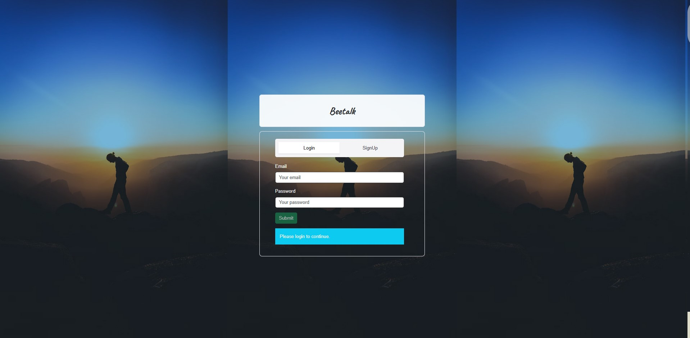
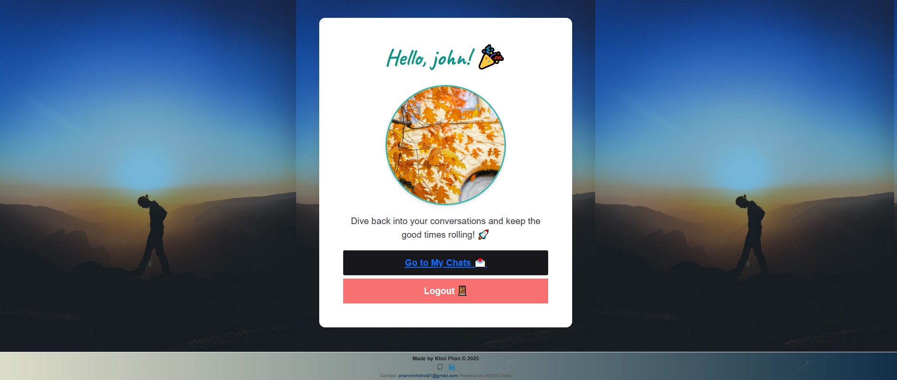
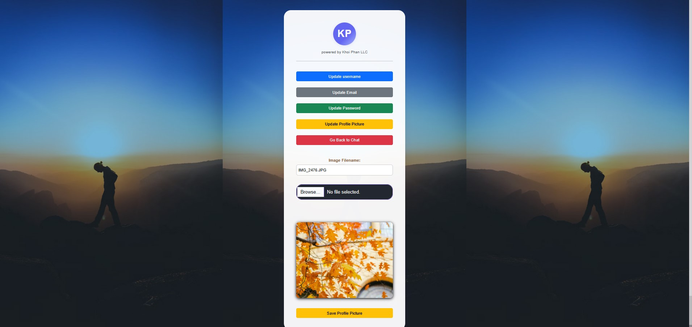
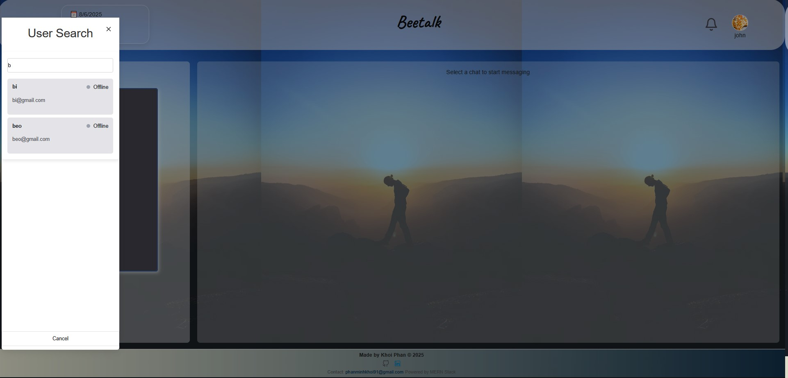
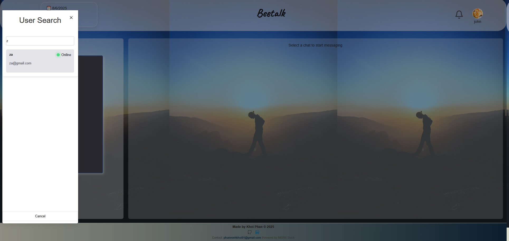
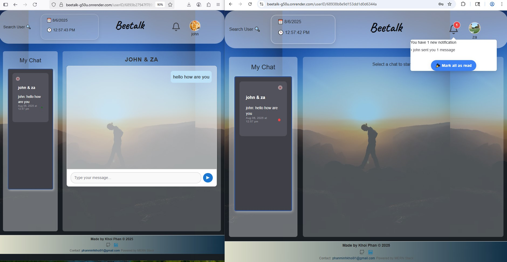
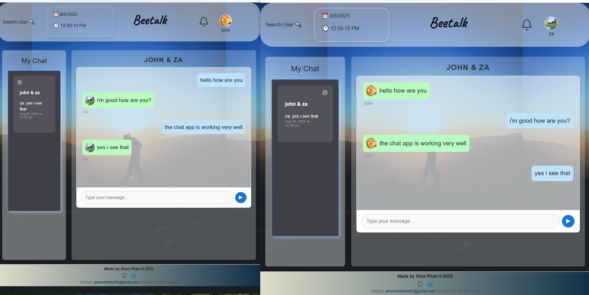

# Beetalk – MERN Chat Application

  


**Application Name:** **Beetalk**  
_A real-time full-stack chat application built with the MERN stack._

---

## 📖 Description

**Beetalk** is a modern, responsive chat app built using the **MERN stack** — **MongoDB**, **Express.js**, **React**, and **Node.js**. It enables real-time messaging with a sleek and intuitive user interface.

The backend leverages both **RESTful APIs** and **GraphQL** (via Apollo Server) for flexible and efficient data handling. Real-time features are powered by **Socket.IO** and **WebSockets**, enabling instant updates and seamless bi-directional communication.

### 🔑 Core Features

- ✅ User authentication & profile management (including profile picture, username, and password updates)
- 💬 Chat room creation and real-time messaging
- 🔔 Unread message notifications
- 👀 Online/offline presence indicators
- 🔍 User search functionality

**Beetalk** is built for scalability and maintainability. It demonstrates the integration of multiple backend paradigms and follows best practices in UI/UX design and state management with React.

---

## 📚 Table of Contents

- [Features](#-features)
- [Technologies Used](#-technologies-used)
- [Installation](#-installation)
- [Usage](#-usage)
- [API Endpoints](#-api-endpoints)
- [App Deployment](#-app-deployment)
- [Screenshots](#-screenshots)
- [Contributing](#-contributing)
- [Contact](#-contact)
- [License](#-license)

---

## 🚀 Features

- Real-time messaging with Socket.IO and WebSockets
- RESTful and GraphQL API support (Apollo Server)
- Secure user authentication and JWT-based authorization
- Profile customization: avatar, username, and password updates
- Unread message notifications
- Online/offline status visibility
- Search for users and start private or group chats
- Responsive and modern UI built with React & Chakra UI
- Scalable architecture with maintainable codebase

---

## 🛠️ Technologies Used

- **Frontend:** React, CSS, Bootstrap, Chakra UI  
- **Backend:** Node.js, Express.js, Apollo Server  
- **Database:** MongoDB with Mongoose ODM  
- **Real-Time Communication:** Socket.IO, WebSockets  
- **Authentication:** JWT, bcrypt  
- **Deployment:** Render (Frontend & Backend), MongoDB Atlas  

---

## 🧰 Installation

> 🧪 **Ensure MongoDB is installed and running locally or use MongoDB Atlas.**

> 🔧 **Rename `.envExample` to `.env` and configure your environment variables accordingly.**

> 💡 **See the note in folder `client/socket-client.js` if you want to run locally.**

1. **Clone the repository:**
   ```bash
   git clone https://github.com/khoiphan-9194/MERN-Chat-App-KP.git
   cd MERN-Chat-App-KP
   ```

2. **Install dependencies and start the development server:**
   ```bash
   npm install
   npm run develop2
   ```

---

## 📌 Usage

- Register a new account or log in with your credentials.
- Customize your profile (upload avatar, update username and password).
- Create chat rooms or private messages.
- Search for users and check their online status.
- Receive real-time notifications for new and unread messages.
- Chat instantly with connected users.

---

## 🔌 API Endpoints

### 🧾 REST
- `POST /api/upload/single` – Upload user profile picture

### 🔮 GraphQL
- `/graphql` – Handles all queries and mutations for users, chats, and messages

---

## 🌐 App Deployment

👉 **Live Demo:** [Beetalk on Render](https://beetalk-g50u.onrender.com/)

---

## 🖼️ Screenshots


|  |  | | | | | 
---

## 🤝 Contributing

Contributions are welcome and appreciated!

1. Fork the repo  
2. Create your feature branch (`git checkout -b feature/YourFeature`)  
3. Commit your changes (`git commit -m 'Add YourFeature'`)  
4. Push to the branch (`git push origin feature/YourFeature`)  
5. Open a pull request

For major changes, please open an issue to discuss your ideas beforehand.

---

## 📬 Contact

Got questions or feedback? Feel free to reach out:

- 📧 Email: [phanminhkhoi91@gmail.com](mailto:phanminhkhoi91@gmail.com)
- 💻 GitHub: [@khoiphan-9194](https://github.com/khoiphan-9194)

---

## 🪪 License

[](https://opensource.org/licenses/MIT)

---

Thanks for checking out **Beetalk**!  

